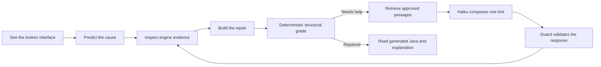

# MagicAI — AI Debugging Studio

## Purpose

MagicAI is MagikLayout's learning intelligence layer. Its main learner-facing
experience is the **AI Debugging Studio** at `#/classroom`: a visual Java Swing
repair lab in which the interface is the lesson. The learner sees a broken UI,
predicts the cause, repairs the component structure, and requests a small,
source-grounded hint only when it is useful.

The product rule is simple:

> **The engine judges. Retrieval grounds. Haiku explains. The guard controls delivery.**

Claude Haiku never decides whether an answer is correct, edits the learner's
structure, or generates the authoritative Java. Those jobs remain deterministic.

## The user problem and the market gap

The core learner is a first- or second-year TVET student who can read Java
statements but cannot yet predict the runtime geometry produced by Swing layout
managers. A conventional GUI builder hides that cause-and-effect relationship;
a general chatbot describes it without seeing the exact component tree.

MagicAI fills the gap between those tools:

- a **live, manipulable Swing state**, rather than a text-only chat;
- **structural diagnosis**, rather than screenshot or pixel similarity;
- **curriculum-governed retrieval**, rather than unrestricted recall;
- **Socratic, bilingual support**, rather than immediately supplying the answer;
- **visible evidence**, so teachers and judges can inspect retrieval, citations,
  guard outcomes, generated Java, and the component tree.

## Learner loop



Every mission follows a three-state visual repair: **broken → tool ready →
repaired**. A prediction is requested before the hint so the learner must form a
mental model. After a successful repair, the coach may release the level-4
worked explanation: *why this works*.

## Studio interface

The Classroom route is intentionally a single-purpose studio. **Lesson Pack**
and **Class Session** are not shown in this route. The page contains:

1. a 12-mission catalogue with manager and difficulty labels;
2. a repair toolbox and two explicit build steps;
3. the live broken or repaired Swing interface;
4. prediction choices and a mission-specific structural inspector;
5. the grounded Layout Coach with English/Bahasa Malaysia switching;
6. an expandable evidence drawer for retrieved/cited chunk ids and guard status;
7. deterministic Java and component-tree evidence that changes with the repair.

The studio is visual-first. Chat supports the manipulation; it does not replace it.

## Mission catalogue

| # | Mission | Manager focus | Concept assessed |
|---:|---|---|---|
| 1 | Two controls in SOUTH | BorderLayout | A region accepts one direct laid-out occupant |
| 2 | Two controls in NORTH | BorderLayout | Resolve a region collision with one nested container |
| 3 | Two controls in EAST | BorderLayout | Last-added component occupies a repeated region |
| 4 | Two controls in WEST | BorderLayout | Preserve multiple controls through nesting |
| 5 | Two controls in CENTER | BorderLayout | CENTER is one region, not an unrestricted canvas |
| 6 | Build a search row | Nested layouts | A JPanel can provide a local FlowLayout inside NORTH |
| 7 | Repair button order | FlowLayout | Visual order follows component add order |
| 8 | Repair keypad order | GridLayout | Cells fill left-to-right, row-by-row |
| 9 | Choose the row manager | Nested JPanel | Each container owns its own layout manager |
| 10 | Move the title home | BorderLayout | Region constraints express placement behaviour |
| 11 | Restore the 2 × 2 grid | GridLayout | Rows and columns define the cell matrix |
| 12 | Find the missing component | FlowLayout | Absence from the tree differs from hidden geometry |

The catalogue covers BorderLayout collisions and constraints, FlowLayout order
and inventory, GridLayout order and dimensions, and nested-container reasoning.

## Where Claude Haiku takes place

Haiku is called only after the deterministic engine has produced a stable
misconception diagnosis and the retrieval pipeline has selected approved
passages. The browser sends those passages and engine findings to the
`coach-rag` Supabase Edge Function. Haiku's narrow task is to compose one short,
age-appropriate, Socratic explanation in `en-MY` or `ms-MY` and cite only the
provided chunk ids.

Haiku does **not**:

- inspect pixels or guess the layout from a screenshot;
- determine pass/fail or change a score;
- invent a Swing rule or use an uncited source;
- reveal full repair code before the learner succeeds;
- replace deterministic feedback when the network or model is unavailable.

When the backend is configured, the UI labels a successful response **Model
composed · guard passed**. If it is unavailable or rejected, reviewed corpus text
is served safely.

## RAG and safety architecture

```text
Swing state
  → deterministic gradeReverse()
  → misconception diagnosis
  → metadata-first corpus retrieval
  → optional Claude Haiku composition
  → citation/language/leakage/contradiction guard
  → hint delivery + privacy-safe log
```

Retrieval uses stable misconception metadata because the engine already knows
the exact structural error. This is more precise and auditable at the present
corpus size than adding a vector database for its own sake. Each governed chunk
has a source id, language, hint level, curriculum tag, version, and reviewer.

The hint ladder is progressive:

| Level | Delivery rule |
|---:|---|
| 1 | A nudge that does not name the repair |
| 2 | The general Swing concept |
| 3 | A structural clue, still without full code |
| 4 | The worked explanation, available after success or teacher unlock |

The guard checks citations, solution leakage, output language, response length,
and contradictions with engine truth. A failure silently substitutes approved
corpus text. Low-confidence retrieval skips the model altogether.

## Evidence and privacy

The evidence drawer makes the invisible AI pipeline inspectable. For each
request it records the misconception code, retrieved chunk ids, cited chunk ids,
model/corpus version, latency, outcome, and guard violations. Learners are
identified by a local privacy-safe label and session code, not by names, emails,
or device identifiers.

Generated Java and the displayed component tree come from the same deterministic
Swing structure used by the grader. They are evidence of the repair, not model
output.

## Graceful operation

- **Backend configured:** retrieval → Haiku → guard → response.
- **Backend unavailable:** reviewed retrieved text is served.
- **Guard rejects output:** reviewed text replaces it.
- **AI disabled:** the deterministic learning and grading loop still works.

This makes the AI valuable without making the lesson dependent on an external
model call.

## Implementation map

| Responsibility | Main implementation |
|---|---|
| Route and single-purpose studio shell | `src/classroom/ClassroomRoute.tsx` |
| Visual studio, hint requests, evidence UI | `src/classroom/CoachLabPanel.tsx` |
| Twelve mission definitions and repair states | `src/classroom/debugStudio.ts` |
| Mission invariants and grading tests | `src/classroom/debugStudio.test.ts` |
| Deterministic structural grading | `src/challenges/grade.ts` |
| Misconception diagnosis | `src/coach/misconceptions.ts` |
| Retrieval, policy, guard, and logging | `src/coach/` |
| Haiku browser adapter | `src/classroom/ragComposer.ts` |
| Protected model endpoint | `supabase/functions/coach-rag/` |
| Studio visual system | `src/classroom/classroom.css` |

## Demonstration sequence

For a clear recording, use one complete mission before showing catalogue depth:

1. Open `#/classroom` and identify the broken live Swing state.
2. Choose a prediction and show the engine response.
3. Ask for one hint; open AI evidence to show retrieval, citation, and guard status.
4. Place the repair tool, then complete the second structural step.
5. Show **Repair verified**, generated Java, and the updated component tree.
6. Ask **Explain why this works** to demonstrate the post-success explanation.
7. Briefly scan the 12 missions to establish breadth without fragmenting the story.

## Honest claim boundary

It is accurate to say that the AI Debugging Studio is implemented, provides 12
interactive missions, performs runtime retrieval over a governed bilingual
corpus, optionally uses Claude Haiku for grounded composition, guards every model
response, and grades deterministically. It is not yet accurate to claim measured
learning gains, broad school adoption, or market leadership without a completed
classroom study.

Before a competition submission, rerun `npm test`, `npm run build`, and
`npm run eval:rag`, then quote the fresh results rather than preserving old counts.

